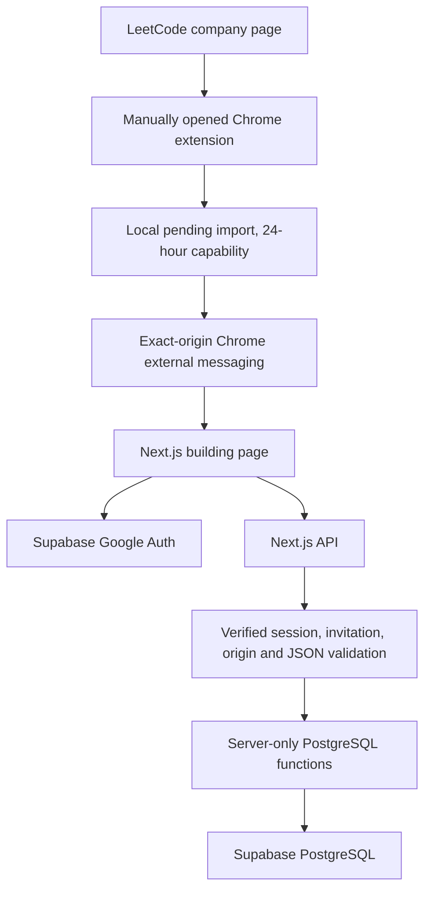
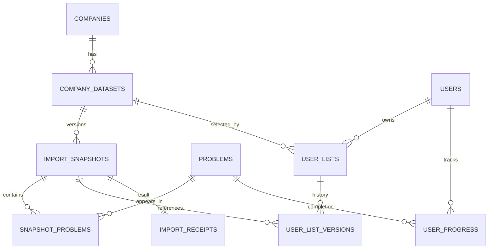
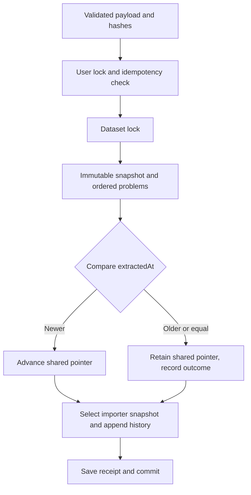

# Architecture

## Database relationships

`001_leetbycompany.sql` enforces unique company slug, company/range, user/dataset,
user/problem progress, snapshot/problem membership and user/extraction idempotency.
Composite foreign keys keep shared/current/history pointers within their dataset.
Snapshot problem rows preserve titles, slugs, frontend IDs, topics, frequency, source
rank and position; later global problem updates do not rewrite historical display.
Internal LeetCode ID identifies progress across lists.

## Transaction and concurrency

`import_list` takes a per-user transaction advisory lock before checking idempotency,
then locks the dataset row before comparing freshness. The snapshot, membership,
shared pointer, personal pointer, history and receipt are committed together.
A constraint error rolls everything back. Company upsert also serializes imports
for the same company. No import changes progress.

Refresh uses the same per-user lock and a personal-list row lock. It verifies the
explicit target is newer and is still the shared winner. The action cannot silently
substitute another snapshot or downgrade the user. History reads never move pointers.

## Authorization model

The browser only contacts same-origin Next.js APIs. Routes call Supabase `getUser`,
then `require_member`; body-supplied user IDs are rejected by strict input schemas.
Only the server has the service key. Public tables have RLS enabled and no browser
role grants or allow policies: default denial is intentional. Authenticated/anonymous
roles cannot call privileged RPCs. Server-only RPCs recheck membership and ownership.
This avoids exposing uploader identifiers or raw import metadata through table APIs.

`read_list` authorizes the personal list and restricts historical snapshots to
that list's history. Knowing another snapshot/list/problem UUID is insufficient.
Newer-version offers expose only snapshot ID and extraction time for an eligible
dataset. Progress writes require a problem in the user's selected/history lists.

## Extension boundary

Chrome grants only activeTab, scripting and storage. The popup starts work and opens the building page immediately; the
worker binds task ID, tab, document, origin and live URL. The content script reads
source pages with the existing same-origin session. Closing the popup does not
cancel; changing company/recency does. The website can retrieve only the random
staged task capability from a top-level trusted `/import` page. Payloads are
validated again at the website/API boundary. LocalStorage retains the website's
pending task or ready import across OAuth, without sending the JSON in a URL.

## Limits

No server snapshot revision exists in the source API. Stable totals do not prove
point-in-time consistency. Client extraction time is untrusted freshness metadata.
Embedded PostgreSQL tests exercise transactions but not independent-process locking.
The API currently loads one complete authorized snapshot for in-memory filtering;
SQL pagination can replace this for larger datasets without changing contracts.
